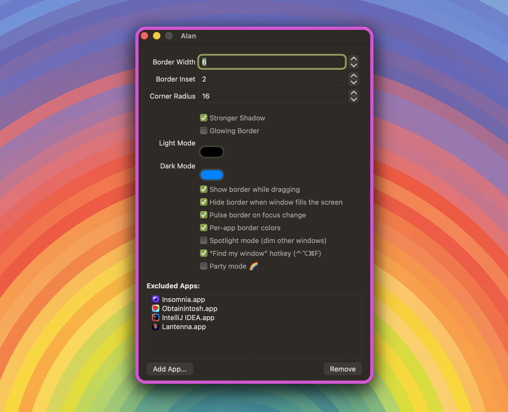

# Alan

Alan draws a colored border around the active window on macOS, so you can
always see where your keyboard input is going.



**Latest release:** v<!-- version -->2.6.0<!-- /version --> · [Download](https://github.com/L-K-M/Alan/releases/latest)

## About this fork

This is a fork of [tylerhall/Alan](https://github.com/tylerhall/Alan).
The fix for windows on secondary displays was contributed back upstream
([tylerhall/Alan#10](https://github.com/tylerhall/Alan/pull/10)); beyond
that, this fork adds:

- A corner radius setting, so the border can hug modern macOS windows
  instead of poking square corners past them.
- An optional stronger drop shadow behind the active window, and an
  optional glow on the border itself.
- A setting to hide the border while a window is being dragged (it
  returns once the window settles), and one to hide it when a window
  fills its screen — judged against the display the window is on, so
  multi-monitor setups work. Windows in native full-screen mode never
  get a border.
- An excluded-apps list, for apps that should never get a border.
- An optional focus pulse: the border briefly thickens when focus
  changes, then settles.
- Optional per-app border colors, with each app's hue derived from its
  bundle identifier — you learn the colors within a day.
- Spotlight mode, the inverse-Alan: instead of a border, everything
  except the focused window is dimmed.
- A "find my window" hotkey (⌃⌥⌘F) that flashes the border three times
  around the focused window.
- Event-driven window tracking via `AXObserver` (replacing the original
  10 Hz polling), with a short-lived timer to follow live drags.
- A status-bar item in hidden-Dock mode, so the app can still be quit and
  configured when it has no Dock icon or menu bar.
- Fixes for the accessibility-permission deep link, `UserDefaults`
  registration, and deprecated `NSColor` archiving.
- CI on every push, and a release workflow that builds and publishes the
  app when a version tag is pushed.

## Install

Grab `Alan-<version>.zip` from the
[Releases page](../../releases), unzip, and move `Alan.app` to
`/Applications`. The releases are built on CI and are only ad-hoc signed,
so on first launch right-click the app and choose **Open** (or run
`xattr -d com.apple.quarantine /Applications/Alan.app`).

Or build it yourself: open `Alan.xcodeproj` in Xcode and hit Run.

## Configuration

Open "Preferences..." from the menubar icon.

The hidden-Dock mode is the one remaining `defaults`-only setting:

```sh
defaults write studio.retina.Alan hideDock -bool true   # takes effect on relaunch
```

## License

[MIT](LICENSE), original © 2025 Tyler Hall.
